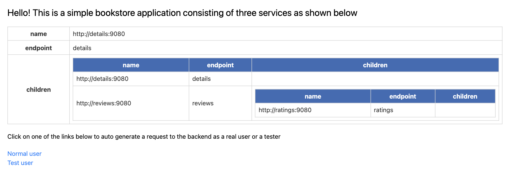

# 5章

5章では、Istioのトラフィック管理を学びます。

## セットアップ

1. サービスメッシュ外に、Ratingサービス用のMySQLコンテナを作成します。これは、`test`データベースに`rating`テーブルを持ちます。

```bash
docker compose -f 05/bookinfo-app/ratings/docker-compose.yaml up -d

docker exec -it ratings-mysql /bin/sh
                                                                                                                                                                              (minikube/default)
sh-4.4# mysql -h localhost -u root -ppassword

mysql> SHOW TABLES FROM test;
+----------------+
| Tables_in_test |
+----------------+
| ratings        |
+----------------+

mysql> USE test;

mysql> SELECT * from ratings;
+----------+--------+
| ReviewID | Rating |
+----------+--------+
|        1 |      5 |
|        2 |      4 |
+----------+--------+
```

2. Istio IngressGatewayをデプロイします。

```bash
helmfile -f 05/istio/istio-ingress/helmfile.yaml apply
```

3. Istio EgressGatewayをデプロイします。

```bash
helmfile -f 05/istio/istio-egress/helmfile.yaml apply
```

4. 各マイクロサービスにIstioカスタムリソースをデプロイします。

```bash
helmfile -f 05/bookinfo-app/database/helmfile.yaml apply

helmfile -f 05/bookinfo-app/details/helmfile.yaml apply

helmfile -f 05/bookinfo-app/productpage/helmfile.yaml apply

helmfile -f 05/bookinfo-app/ratings/helmfile.yaml apply

helmfile -f 05/bookinfo-app/reviews/helmfile.yaml apply
```

5. Bookinfoアプリケーションに接続し、**Normal user**をクリックします。



6. Productpageに接続します。


## 機能を実践する
