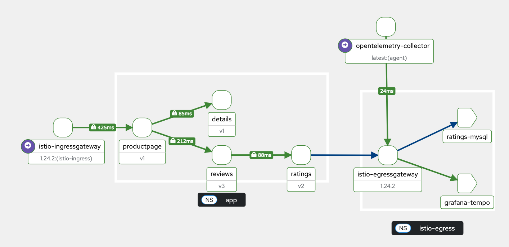

# istio-demo

## プロジェクトについて

Bookinfoアプリケーションを使用して、Istioをデモンストレーションします。



## 章の構成

- [1章](./chapter-01/README.md)
- [2章](./chapter-02/README.md)
- [3章](./chapter-03/README.md)
- [4章](./chapter-04/README.md)
- [5章](./chapter-05/README.md)
- [6章](./chapter-06/README.md)
- [7章](./chapter-07/README.md)
- [8章](./chapter-08/README.md)
- [9章](./chapter-09/README.md)
- [10章](./chapter-10/README.md)
- [11章](./chapter-11/README.md)
- [おまけ1章](./chapter-extra-01/README.md)
- [おまけ2章](./chapter-extra-02/README.md)
- [おまけ2章](./chapter-extra-03/README.md)

## 始める

### 前提

1. 以下をインストールします。

- [mise](https://mise.jdx.dev/getting-started.html)
- [Docker Desktop](https://docs.docker.com/desktop/)

2. miseを使用して、そのほかに必要なツールをインストールします。

```bash
$ mise trust

$ mise install
```

### Kubernetesクラスターのセットアップ

1. Docker Desktopの[リソース](https://docs.docker.com/desktop/settings-and-maintenance/settings/#resources) で、以下を設定します。

- ハードウェアリソースの割り当てで、CPUを`4`コア、メモリを`9`GB以上にしてください。
- ファイルシェアリングで、`/User`以外のパスを削除してください。もし`/User`以外のパスを他のコンテナで使用している場合は、そのままで問題ありません

2. Minikubeを使用して、Kubernetesクラスターを作成します。

```bash
# バージョン
KUBERNETES_VERSION=1.32.3

# コントロールプレーンを含むNode数
NODE_COUNT=8

# ハードウェアリソース
CPU=4
MEMORY=8192

minikube start \
  --profile istio-demo \
  --nodes ${NODE_COUNT} \
  --container-runtime containerd \
  --driver docker \
  --mount true \
  --mount-string "$(dirname $(pwd))/istio-demo:/data" \
  --kubernetes-version v${KUBERNETES_VERSION} \
  --cpus ${CPU} \
  --memory ${MEMORY}
```

3. ワーカーNodeにNodeグループを表すラベルを設定します。

```bash
# istio-demo-m02 (app Node 1)
kubectl label node istio-demo-m02 node.kubernetes.io/nodegroup=app --overwrite \
  && kubectl label node istio-demo-m02 node-role.kubernetes.io/worker=worker --overwrite

# istio-demo-m03 (app Node 2)
kubectl label node istio-demo-m03 node.kubernetes.io/nodegroup=app --overwrite \
  && kubectl label node istio-demo-m03 node-role.kubernetes.io/worker=worker --overwrite

# istio-demo-m04 (app Node 3)
kubectl label node istio-demo-m04 node.kubernetes.io/nodegroup=app --overwrite \
  && kubectl label node istio-demo-m04 node-role.kubernetes.io/worker=worker --overwrite

# istio-demo-m05 (ingress Node)
kubectl label node istio-demo-m05 node.kubernetes.io/nodegroup=ingress --overwrite \
  && kubectl label node istio-demo-m05 node-role.kubernetes.io/worker=worker --overwrite

# istio-demo-m06 (egress Node)
kubectl label node istio-demo-m06 node.kubernetes.io/nodegroup=egress --overwrite \
  && kubectl label node istio-demo-m06 node-role.kubernetes.io/worker=worker --overwrite

# istio-demo-m07 (system Node 1)
kubectl label node istio-demo-m07 node.kubernetes.io/nodegroup=system --overwrite \
  && kubectl label node istio-demo-m07 node-role.kubernetes.io/worker=worker --overwrite

# istio-demo-m08 (system Node 2)
kubectl label node istio-demo-m08 node.kubernetes.io/nodegroup=system --overwrite \
  && kubectl label node istio-demo-m08 node-role.kubernetes.io/worker=worker --overwrite
```

4. Nodeを確認します。

```bash
kubectl get nodes -L node.kubernetes.io/nodegroup

NAME             STATUS   ROLES           AGE     VERSION   NODEGROUP
istio-demo       Ready    control-plane   8m29s   v1.32.3
istio-demo-m02   Ready    worker          8m18s   v1.32.3   app
istio-demo-m03   Ready    worker          8m5s    v1.32.3   app
istio-demo-m04   Ready    worker          7m50s   v1.32.3   app
istio-demo-m05   Ready    worker          7m41s   v1.32.3   ingress
istio-demo-m06   Ready    worker          7m27s   v1.32.3   egress
istio-demo-m07   Ready    worker          7m16s   v1.32.3   system
istio-demo-m08   Ready    worker          7m1s    v1.32.3   system
```
